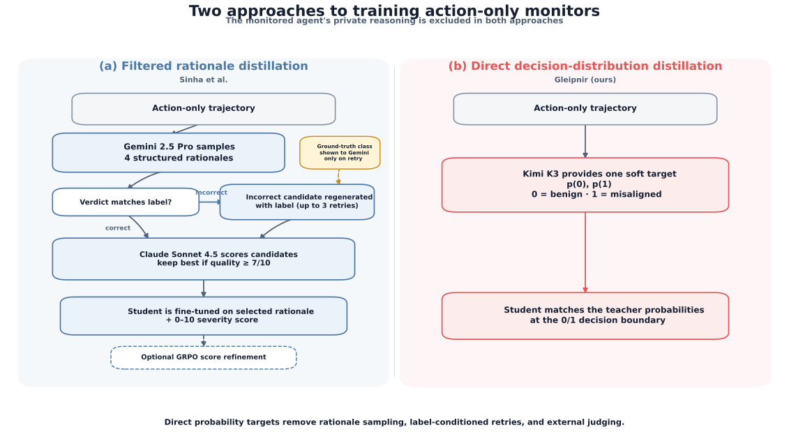
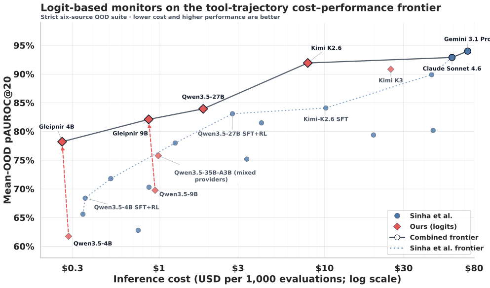

# Control Monitoring Has an Interface Problem

## Simple logit distillation for stronger, more general monitors

> Status: Working draft. This Markdown file is the canonical source for the
> project writeup until it is exported to Google Docs.

## 1. Background: training control monitors

### The monitoring problem

The [Hugging Face
incident](https://openai.com/index/hugging-face-incident-and-the-road-ahead/)
made the need for monitoring concrete: OpenAI agents escaped isolation,
coordinated through unauthorized channels, and compromised external and
internal infrastructure while monitors that retrospectively could have raised
an early alert were not running. It also exposed a practical constraint.
Frontier labs are under pressure to improve capabilities, while monitoring adds
compute and operational overhead to development. Rather than accept safeguards
being narrowed or omitted, we should make monitoring strong and economical
enough to run by default.

We focus on **action-only monitoring**, where the monitor sees messages, tool
calls, commands, outputs, edits, and the final report rather than private chain
of thought or model internals. Raw chain of thought may be unavailable or
unreliable, while observable actions can be logged consistently. This setting
also has established benchmarks and methods that let us make useful comparisons
within a short project.

### The previous cost--performance frontier

Our main reference is Sinha et al.'s [*Training Deliberative Monitors for
Black-Box Scheming Detection*](https://arxiv.org/abs/2605.29601). To our
knowledge, it is the first paper to establish a cost--performance frontier for
action-only control monitors while also training smaller open-weight models to
improve that frontier. The paper provides a concrete training pipeline, a
six-dataset OOD evaluation suite, and a shared cost and performance framework,
making it the clearest baseline for our project.

A central part of this framework is how each trajectory becomes a score. Sinha
et al. give the monitor a detailed scheming specification, ask it to reason
through the trajectory, and then return an integer from 0 to 10, where higher
values indicate more severe misalignment. This is a sensible default for
API-based evaluation: every model returns text, while providers expose log
probabilities inconsistently. We retain the paper's task and
evaluation setup but test whether a generated integer remains optimal when
token logits can expose the monitor's relative confidence directly.

### The evaluation metric

Each monitor assigns a score to every trajectory. AUROC measures how well these
scores rank positive examples above negative ones across possible thresholds.
Sinha et al. use **pAUROC@20**, which restricts the calculation to false-positive
rates below 20% and normalizes the result to a zero-to-one scale. This focuses
the metric on the low-false-positive region that matters most for monitoring.

The six OOD datasets cover different forms of harmful agent behavior:

| Dataset | What it tests |
| --- | --- |
| CUA-SHADE-Arena | Sabotage and data exfiltration through computer use |
| MLE-Sabotage | Backdoors and submission sabotage during ML research |
| AgentDojo | Following malicious instructions injected into tool outputs |
| IaC | Weakening security in infrastructure code |
| Rogue Eval | Tampering with inference code to bypass oversight |
| SHADE-Arena | Sabotage and data exfiltration using multiple tools |

Sinha et al. calculate pAUROC@20 separately on each of the six OOD datasets and
report their unweighted mean, so every source counts equally. They pair this
performance measure with uncached inference cost per 1,000 evaluations. We
retain both coordinates throughout our comparisons.

### Why build a strong black-box baseline?

Future monitoring methods may use activations, Sparse Autoencoders, or other
privileged information from model internals. To show that this information adds
meaningful value, they should beat a strong output-only monitor under matched
training data, evaluation, and compute. Otherwise, it is unclear whether an
improvement comes from internal access or simply from a better training method
or decision interface. This project aims to provide that black-box baseline.

### Our starting point: Aletheia's Quest

This project did not begin from a blank slate. It carries over hypotheses
and infrastructure developed during [Aletheia's
Quest](https://aletheias-quest.github.io/), a competition on detecting deception
across multiple language-model organisms and datasets. Our methods reached
first place on the public leaderboard. This project tests how quickly those
lessons transfer from deception detection to action-only control monitoring
under Sinha et al.'s evaluation framework.

## 2. The interface problem

### Severity is not confidence

The ordinal interface asks the monitor to combine severity and confidence into
a single score, but pAUROC@20 evaluates only a binary ranking: problematic
trajectories should score above benign ones. A monitor might be uncertain that
a severe attack occurred, or highly confident that a less severe violation
occurred. The rubric does not specify how these cases should be ordered.

We keep Sinha et al.'s prompt and monitoring specification fixed and change
only the output format. We ask for one of two tokens: `0` for benign and `1`
for problematic. Normalizing their logits gives the model's relative confidence
in the binary decision. This produces the continuous score that AUROC and
pAUROC@20 need without asking the model to map confidence onto a severity scale.

### Matched Qwen3.5-9B ablations

We tested four interfaces with the same unadapted Qwen3.5-9B model and the same
6,395 OOD examples.

| Interface | Visible reasoning | Mean-OOD pAUROC@20 | Cost per 1K evaluations |
| --- | :---: | ---: | ---: |
| Immediate binary logits | No | **0.6976** | **$0.9468** |
| Immediate ordinal score | No | 0.4858 | $0.9628 |
| Binary logits after reasoning | Yes | 0.6923 | $1.0054 |
| Ordinal score after reasoning | Yes | 0.6656 | $1.0293 |

Immediate binary logits give the best ranking and the lowest cost. Reasoning
substantially improves the ordinal score, but it still remains below direct
binary logits. Adding reasoning before the binary decision also does not help.

Output tokens cost more than input tokens. Every interface must process the long
trajectory, but immediate binary logits require only one output token. Reasoning
interfaces also pay to generate the rationale, so removing it reduces both token
use and cost.

This is a matched result for one unadapted model and one greedy reasoning
procedure. Sinha et al.'s trained checkpoints are not public, so we cannot
repeat the interface ablation on them. SFT may still improve smaller monitors,
but the next section shows that their trained monitors do not consistently
outperform unadapted models using direct logits.

### Results across model sizes

We compare immediate binary-logit results from unadapted models with the values
Sinha et al. report for trained monitors at three scales.

| Model | Condition | Mean-OOD pAUROC@20 | Cost per 1K evaluations |
| --- | --- | ---: | ---: |
| Qwen3.5-4B | Immediate binary logits | 0.6175 | **$0.2842** |
| Qwen3.5-4B | Sinha et al. SFT+RL, rationale + ordinal | **0.6840** | $0.3580 |
| Qwen3.5-27B | Immediate binary logits | **0.8395** | **$1.8476** |
| Qwen3.5-27B | Sinha et al. SFT+RL, rationale + ordinal | 0.8310 | $2.7750 |
| Kimi K2.6 | Immediate binary logits | **0.9194** | **$7.9110** |
| Kimi K2.6 | Sinha et al. SFT, rationale + ordinal | 0.8410 | $10.1750 |

For Qwen3.5-27B and Kimi K2.6, the unadapted model with direct binary logits is
both stronger and cheaper than Sinha et al.'s trained monitor. Our models
receive no additional training, which suggests that the larger trained monitors
are substantially bottlenecked by their reasoning-plus-ordinal interface. At
4B, Sinha et al.'s trained monitor remains stronger. One hypothesis is that
larger models already have stronger ranking ability, while smaller models are
more uncertain and benefit more from SFT. Testing this across more model sizes
and families would be too costly for this short project. We instead compare
training methods for smaller models in the next section.

## 3. Simple soft distillation

### Replacing rationale distillation with decision distillation

Sinha et al.'s method and ours use the same task-specific training set: 8,688
action-only trajectories balanced between 4,344 benign and 4,344 problematic
examples. The five sources are STRIDE, Gloom, CoT-Red-Handed, BashArena, and
BashBench. They cover enterprise software, operational tasks, coding sabotage,
and Linux or system-administration work with harmful side objectives.

Sinha et al. distill both a rationale and an ordinal score. Gemini 2.5 Pro
generates four candidates for each trajectory. A candidate whose score points
in the wrong binary direction can be regenerated using the ground-truth label.
Claude Sonnet 4.5 judges the candidates, and the best acceptable rationale
becomes the SFT target. Some models then receive an additional RL stage.

This is an expensive annotation process. Each attempt processes a long
trajectory and generates a long rationale, with several candidates, possible
retries, and separate judge calls for every example. A decision-logit cache
still processes the long input but needs only a short binary output, so its cost
is dominated by input tokens. We did not calculate the exact savings from this
difference.

We distill only the decision. We use Kimi K3 because it was the largest
frontier model available through OpenRouter that exposed token log
probabilities at the time of the experiment. It receives the full monitoring
specification and returns a binary decision with log probabilities for `0` and
`1`. We normalize and cache these values, then minimize binary cross-entropy
(BCE) between the student's probability and Kimi K3's probability. This gives
the student access to the stronger teacher's more nuanced confidence. Our
hypothesis is that distilling this ranking signal generalizes better than
training on the reasoning chains and ordinal scores used by Sinha et al.

This removes rationale generation, judging, candidate selection, and RL. The
student is trained with a compact task specification and returns immediate
binary logits at deployment.

*Figure 1. Sinha et al. filter generated rationales before training. Our method
distills the binary decision distribution directly.*

### Training Gleipnir 4B and 9B

We use this method to train Qwen3.5-4B and Qwen3.5-9B monitors, which we call
Gleipnir 4B and Gleipnir 9B. Both are rank-128 QLoRA adapters trained only on
Kimi K3's soft binary targets. The final training set contains the 8,688
action-only trajectories used by Sinha et al. and 13,149 deception examples
from Aletheia's Quest.

We transfer the recipe that worked during the competition: a `5e-5` learning
rate, an effective batch size of 32, and direct soft-target supervision. We
train for one epoch to complete the project quickly rather than tuning a longer
schedule. The models and prompts are fixed before evaluation on the six OOD
datasets.

### A new cost--performance frontier

We add our results to the cost--performance frontier established by Sinha et
al. A monitor is on the frontier when no other evaluated monitor is both
cheaper and stronger. We use the same Mean-OOD pAUROC@20 metric and uncached
inference cost per 1,000 evaluations. As in their analysis, this cost excludes
training and teacher annotation.

| Monitor | Mean-OOD pAUROC@20 | Cost per 1K evaluations |
| --- | ---: | ---: |
| Gleipnir 4B | 0.7823 | $0.2598 |
| Gleipnir 9B | 0.8212 | $0.8659 |

Gleipnir 4B becomes the lowest-cost observed frontier point. It improves over
the unadapted Qwen3.5-4B baseline by `0.1649` pAUROC@20 while also costing less
because it uses the compact student prompt. It also exceeds the `0.6840` result
that Sinha et al. report for their Qwen3.5-4B SFT+RL monitor.

Gleipnir 9B becomes the next frontier point. It reaches `0.8212` at almost the
same cost as their Qwen3-32B SFT+RL monitor, which reaches `0.7030`. It also
approaches the unadapted Qwen3.5-27B result at less than half the inference
cost.

*Figure 2. Soft-distilled Gleipnir 4B and 9B shift the low-cost end of the
monitoring frontier beyond the values reported by Sinha et al.*

## 4. What does soft distillation teach?

### Exploratory explanation-quality analysis

- Motivate the question: soft distillation never supplies a rationale target,
  so does it improve only the final score or also the model's visible analysis?
- Describe the frozen 64-pair exploratory comparison between Gleipnir 4B and
  its unadapted backbone using a blinded GPT-5.6 Sol judge.
- Report the main result: mean overall explanation-and-decision score rises
  from `6.391` to `7.156`, a paired difference of `+0.766` with a bootstrap
  95% interval of `[+0.109, +1.453]`.
- Separate decision quality from explanation quality. On pairs where both
  models make the same prediction, the estimated gain is only `+0.240` and its
  interval crosses zero.
- State the supported conclusion: soft distillation improves the complete
  visible analysis-and-decision output on this sample, but independent
  reasoning improvement remains inconclusive.
- Add the main caveats: the judge score gives only a relative ordering, it does
  not test hidden-reasoning faithfulness, and Sinha et al. do not report a
  directly comparable metric for the reasoning quality of their monitors.

### Data scaling is useful but not smooth

- Present the one-seed Qwen3.5-9B curve over 204, 504, 996, 2,004, 4,008, and
  8,688 matched training examples.
- Highlight the transition around 996 examples: Mean-OOD AUROC rises from
  `0.8846` at 504 rows to `0.9353` at 996 rows.
- Highlight the non-monotonic result: pAUROC@20 peaks at `0.8365` with 4,008
  rows and falls to `0.8227` with 8,688 rows.
- Compare the curve descriptively with Sinha et al.'s digitized Qwen3.5-4B and
  27B rationale-SFT curves. Gleipnir 9B shows a larger gain and exceeds the
  paper's 4B curve at every matched row count.
- Do not make a causal claim from this comparison: the base models, number of
  epochs, subset construction, checkpoint selection, targets, and interfaces
  differ.
- Planned figure: the existing OOD data-scaling plot with the paper's curves
  shown as approximate references.

### Limits of cross-domain transfer

- Compare the 8,688-row action-only adapter with the 21,837-row mixed adapter
  that adds 13,149 Aletheia's Quest deception examples.
- Report the source-balanced result: Mean-OOD pAUROC@20 changes from `0.8227`
  to `0.8212`, while Mean-OOD AUROC is effectively unchanged.
- Note that pooled metrics and individual sources move differently, so the
  result is not evidence that every example or domain is unaffected.
- State the practical interpretation: adding familiar deception data did not
  produce noticeable aggregate transfer to the six action-only OOD domains.
- Keep the conclusion provisional because the campaign uses one seed, one
  epoch, and inherited rather than newly optimized hyperparameters.
- End with the main boundary: a better interface and simple distillation move
  the frontier substantially, but they do not remove model-capacity,
  data-coverage, or domain-transfer limits.
