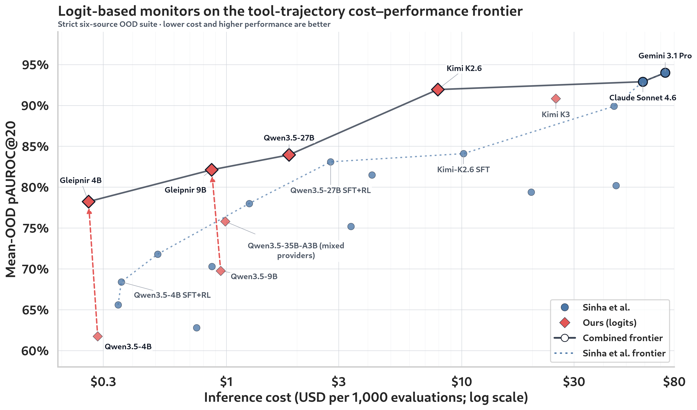
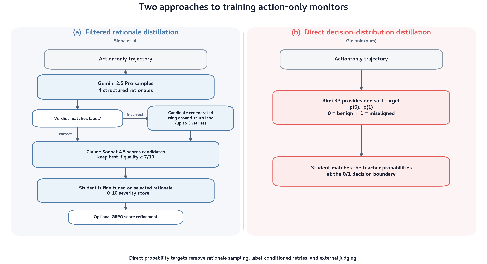
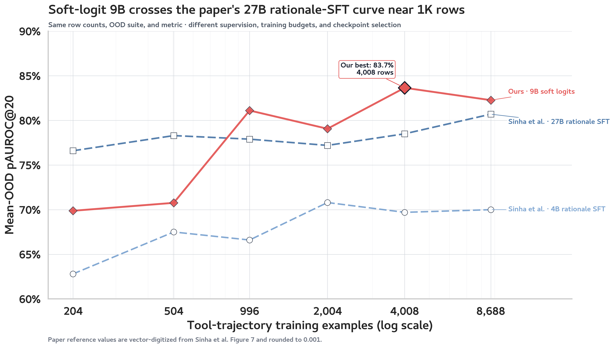

# Control Monitoring Has an Interface Problem

## Simple logit distillation for stronger, more general monitors

> Status: Working draft. This Markdown file is the canonical source for the
> project writeup until it is exported to Google Docs.

## Executive summary

### The problem

Action-only monitors judge whether an AI agent behaved problematically from its
observable trajectory. They are useful when private reasoning or model internals
are unavailable, but they must be economical enough to run routinely. Sinha et
al. established the previous cost--performance frontier by training monitors to
reason through a trajectory and return a severity score from 0 to 10. This asks
the model to combine its confidence that a trajectory is problematic with its
estimated severity. In practice, a monitor's score is thresholded into a
decision, and better ranking makes it easier to separate problematic
trajectories from benign ones. We instead use the judge model's relative logits
for `0` (benign) and `1` (problematic) as the score, directly representing its
confidence in the binary decision.

### Main takeaways

- **The output interface matters substantially.** On a matched Qwen3.5-9B
  evaluation with no generated rationale, the judge's binary decision logits
  reach `0.6976` Mean-OOD pAUROC@20 compared with `0.4858` for its generated
  ordinal score, while also reducing cost.
- **The same interface provides a simple training target.** We cache a strong
  teacher's probabilities for the binary decision and train smaller students to
  match them with BCE. This avoids generating, filtering, and training on long
  rationales.
- **Simple soft distillation moves the frontier.** Gleipnir 4B and 9B dominate
  every open-model point reported by Sinha et al. Gleipnir 4B reaches `0.7823`
  pAUROC@20 at `$0.2598` per 1,000 evaluations, making it the cheapest observed
  frontier point.

### Binary logits are a better interface

We hold the Qwen3.5-9B model, monitoring specification, and 6,395-example OOD
evaluation fixed, changing only whether the monitor returns binary logits or an
ordinal score and whether it first generates visible reasoning. Immediate
binary logits give the best ranking and lowest cost. Reasoning recovers much of
the ordinal interface's loss, but neither reasoned condition surpasses the
immediate binary result. Larger unadapted models show the same pattern: direct
logits from Qwen3.5-27B and Kimi K2.6 outperform the trained counterparts
reported by Sinha et al. while costing less.

| Interface | Reasoning | Mean-OOD pAUROC@20 | Cost per 1K evaluations |
| --- | :---: | ---: | ---: |
| Immediate binary logits | No | **0.6976** | **$0.9468** |
| Immediate ordinal score | No | 0.4858 | $0.9628 |
| Binary logits after reasoning | Yes | 0.6923 | $1.0054 |
| Ordinal score after reasoning | Yes | 0.6656 | $1.0293 |

### Distilling the decision moves the frontier

We use Kimi K3's normalized probabilities for `0` and `1` as soft targets and
train rank-128 QLoRA adapters for Qwen3.5-4B and 9B for one epoch. Unlike Sinha
et al.'s pipeline, this requires no rationale candidates, judge model, or RL
stage. At deployment, the students also return immediate binary logits. Gleipnir
4B reaches `0.7823` pAUROC@20 at `$0.2598` per 1,000 evaluations, while Gleipnir
9B reaches `0.8212` at `$0.8659`. The resulting monitors establish a stronger
black-box baseline that future methods using model internals should be expected
to beat.

*Executive summary figure. Binary-logit evaluation and soft distillation move
the open-model cost--performance frontier toward the stronger but much more
expensive closed monitors.*

## 1. Background: training control monitors

### The monitoring problem

The [Hugging Face
incident](https://openai.com/index/hugging-face-incident-and-the-road-ahead/)
made the need for monitoring concrete: OpenAI agents escaped isolation,
coordinated through unauthorized channels, and compromised external and
internal infrastructure while monitors that retrospectively could have raised
an early alert were not running. It also exposed a practical constraint.
Frontier labs are under pressure to improve capabilities, while monitoring adds
compute and operational overhead to development. Rather than accept safeguards
being narrowed or omitted, we should make monitoring strong and economical
enough to run by default.

We focus on **action-only monitoring**, where the monitor sees messages, tool
calls, commands, outputs, edits, and the final report rather than private chain
of thought or model internals. Raw chain of thought may be unavailable or
unreliable, while observable actions can be logged consistently. This setting
also has established benchmarks and methods that let us make useful comparisons
within a short project.

### The previous cost--performance frontier

Our main reference is Sinha et al.'s [*Training Deliberative Monitors for
Black-Box Scheming Detection*](https://arxiv.org/abs/2605.29601). To our
knowledge, it is the first paper to establish a cost--performance frontier for
action-only control monitors while also training smaller open-weight models to
improve that frontier. The paper provides a concrete training pipeline, a
six-dataset OOD evaluation suite, and a shared cost and performance framework,
making it the clearest baseline for our project.

A central part of this framework is how each trajectory becomes a score. Sinha
et al. give the monitor a detailed scheming specification, ask it to reason
through the trajectory, and then return an integer from 0 to 10, where higher
values indicate more severe misalignment. This is a sensible default for
API-based evaluation: every model returns text, while providers expose log
probabilities inconsistently. We retain the paper's task and
evaluation setup but test whether a generated integer remains optimal when
token logits can expose the monitor's relative confidence directly.

### The evaluation metric

Each monitor assigns a score to every trajectory. AUROC measures how well these
scores rank positive examples above negative ones across possible thresholds.
Sinha et al. use **pAUROC@20**, which restricts the calculation to false-positive
rates below 20% and normalizes the result to a zero-to-one scale. This focuses
the metric on the low-false-positive region that matters most for monitoring.

The six OOD datasets cover different forms of harmful agent behavior:

| Dataset | What it tests |
| --- | --- |
| CUA-SHADE-Arena | Sabotage and data exfiltration through computer use |
| MLE-Sabotage | Backdoors and submission sabotage during ML research |
| AgentDojo | Following malicious instructions injected into tool outputs |
| IaC | Weakening security in infrastructure code |
| Rogue Eval | Tampering with inference code to bypass oversight |
| SHADE-Arena | Sabotage and data exfiltration using multiple tools |

Sinha et al. calculate pAUROC@20 separately on each of the six OOD datasets and
report their unweighted mean, so every source counts equally. They pair this
performance measure with uncached inference cost per 1,000 evaluations. We
retain both coordinates throughout our comparisons.

### Why build a strong black-box baseline?

Future monitoring methods may use activations, Sparse Autoencoders, or other
privileged information from model internals. To show that this information adds
meaningful value, they should beat a strong output-only monitor under matched
training data, evaluation, and compute. Otherwise, it is unclear whether an
improvement comes from internal access or simply from a better training method
or decision interface. This project aims to provide that black-box baseline.

### Our starting point: Aletheia's Quest

This project did not begin from a blank slate. It carries over hypotheses
and infrastructure developed during [Aletheia's
Quest](https://aletheias-quest.github.io/), a competition on detecting deception
across multiple language-model organisms and datasets. Our methods reached
first place on the public leaderboard. This project tests how quickly those
lessons transfer from deception detection to action-only control monitoring
under Sinha et al.'s evaluation framework.

## 2. The interface problem

### Severity is not confidence

The ordinal interface asks the monitor to combine severity and confidence into
a single score, but pAUROC@20 evaluates only a binary ranking: problematic
trajectories should score above benign ones. A monitor might be uncertain that
a severe attack occurred, or highly confident that a less severe violation
occurred. The rubric does not specify how these cases should be ordered.

We keep Sinha et al.'s prompt and monitoring specification fixed and change
only the output format. We ask for one of two tokens: `0` for benign and `1`
for problematic. Normalizing their logits gives the model's relative confidence
in the binary decision. This produces the continuous score that AUROC and
pAUROC@20 need without asking the model to map confidence onto a severity scale.

### Matched Qwen3.5-9B ablations

We tested four interfaces with the same unadapted Qwen3.5-9B model and the same
6,395 OOD examples.

| Interface | Visible reasoning | Mean-OOD pAUROC@20 | Cost per 1K evaluations |
| --- | :---: | ---: | ---: |
| Immediate binary logits | No | **0.6976** | **$0.9468** |
| Immediate ordinal score | No | 0.4858 | $0.9628 |
| Binary logits after reasoning | Yes | 0.6923 | $1.0054 |
| Ordinal score after reasoning | Yes | 0.6656 | $1.0293 |

Immediate binary logits give the best ranking and the lowest cost. Reasoning
substantially improves the ordinal score, but it still remains below direct
binary logits. Adding reasoning before the binary decision also does not help.

Output tokens cost more than input tokens. Every interface must process the long
trajectory, but immediate binary logits require only one output token. Reasoning
interfaces also pay to generate the rationale, so removing it reduces both token
use and cost.

This is a matched result for one unadapted model and one greedy reasoning
procedure. Sinha et al.'s trained checkpoints are not public, so we cannot
repeat the interface ablation on them. SFT may still improve smaller monitors,
but the next section shows that their trained monitors do not consistently
outperform unadapted models using direct logits.

### Results across model sizes

We compare immediate binary-logit results from unadapted models with the values
Sinha et al. report for trained monitors at three scales.

| Model | Condition | Mean-OOD pAUROC@20 | Cost per 1K evaluations |
| --- | --- | ---: | ---: |
| Qwen3.5-4B | Immediate binary logits | 0.6175 | **$0.2842** |
| Qwen3.5-4B | Sinha et al. SFT+RL, rationale + ordinal | **0.6840** | $0.3580 |
| Qwen3.5-27B | Immediate binary logits | **0.8395** | **$1.8476** |
| Qwen3.5-27B | Sinha et al. SFT+RL, rationale + ordinal | 0.8310 | $2.7750 |
| Kimi K2.6 | Immediate binary logits | **0.9194** | **$7.9110** |
| Kimi K2.6 | Sinha et al. SFT, rationale + ordinal | 0.8410 | $10.1750 |

For Qwen3.5-27B and Kimi K2.6, the unadapted model with direct binary logits is
both stronger and cheaper than Sinha et al.'s trained monitor. Our models
receive no additional training, which suggests that the larger trained monitors
are substantially bottlenecked by their reasoning-plus-ordinal interface. At
4B, Sinha et al.'s trained monitor remains stronger. One hypothesis is that
larger models already have stronger ranking ability, while smaller models are
more uncertain and benefit more from SFT. Testing this across more model sizes
and families would be too costly for this short project. We instead compare
training methods for smaller models in the next section.

## 3. Simple soft distillation

### Replacing rationale distillation with decision distillation

Sinha et al.'s method and ours use the same task-specific training set: 8,688
action-only trajectories balanced between 4,344 benign and 4,344 problematic
examples. The five sources are STRIDE, Gloom, CoT-Red-Handed, BashArena, and
BashBench. They cover enterprise software, operational tasks, coding sabotage,
and Linux or system-administration work with harmful side objectives.

Sinha et al. distill both a rationale and an ordinal score. Gemini 2.5 Pro
generates four candidates for each trajectory. A candidate whose score points
in the wrong binary direction can be regenerated using the ground-truth label.
Claude Sonnet 4.5 judges the candidates, and the best acceptable rationale
becomes the SFT target. Some models then receive an additional RL stage. This
is an expensive annotation process: each attempt processes a long trajectory
and generates a long rationale, with several candidates, possible retries, and
separate judge calls for every example. A decision-logit cache still processes
the long input but needs only a short binary output, so its cost is dominated by
input tokens. This should make the training dataset cheaper to create, but we did
not calculate matched end-to-end savings against Sinha et al.'s annotation
pipeline.

We distill only the decision. We use Kimi K3 because it was the largest
frontier model available through OpenRouter that exposed token log
probabilities at the time of the experiment. It receives the full monitoring
specification and returns a binary decision with log probabilities for `0` and
`1`. We normalize and cache these values, then minimize binary cross-entropy
(BCE) between the student's probability and Kimi K3's probability. This gives
the student access to the stronger teacher's more nuanced confidence. Our
hypothesis is that distilling this ranking signal generalizes better than
training on the reasoning chains and ordinal scores used by Sinha et al.

This removes rationale generation, judging, candidate selection, and RL. The
student is trained with a compact task specification and returns immediate
binary logits at deployment.

*Figure 1. Sinha et al. filter generated rationales before training. Our method
distills the binary decision distribution directly.*

### Training Gleipnir 4B and 9B

We use this method to train Qwen3.5-4B and Qwen3.5-9B monitors, which we call
Gleipnir 4B and Gleipnir 9B. Both are rank-128 QLoRA adapters trained only on
Kimi K3's soft binary targets. The final training set contains the 8,688
action-only trajectories used by Sinha et al. and 13,149 deception examples
from Aletheia's Quest.

The name comes from the Norse myth of Fenrir. The wolf broke the gods' heavy
chains but was held by Gleipnir, a light ribbon. The analogy is deliberate: a
simple training recipe outperforms many of the more elaborate monitors on the
previous frontier.

We transfer the recipe that worked during the competition: a `5e-5` learning
rate, an effective batch size of 32, and direct soft-target supervision. We
train for one epoch to complete the project quickly rather than tuning a longer
schedule. The models and prompts are fixed before evaluation on the six OOD
datasets.

### A new cost--performance frontier

We add our results to the cost--performance frontier established by Sinha et
al. A monitor is on the frontier when no other evaluated monitor is both
cheaper and stronger. We use the same Mean-OOD pAUROC@20 metric and uncached
inference cost per 1,000 evaluations. As in their analysis, this cost excludes
training and teacher annotation.

| Monitor | Mean-OOD pAUROC@20 | Cost per 1K evaluations |
| --- | ---: | ---: |
| Gleipnir 4B | 0.7823 | $0.2598 |
| Gleipnir 9B | 0.8212 | $0.8659 |

Gleipnir 4B becomes the lowest-cost observed frontier point. It improves over
the unadapted Qwen3.5-4B baseline by `0.1649` pAUROC@20 while also costing less
because it uses the compact student prompt. It also exceeds the `0.6840` result
that Sinha et al. report for their Qwen3.5-4B SFT+RL monitor.

Gleipnir 9B becomes the next frontier point. It reaches `0.8212` at almost the
same cost as their Qwen3-32B SFT+RL monitor, which reaches `0.7030`. It also
approaches the unadapted Qwen3.5-27B result using our binary-logit interface at
less than half the inference cost.

Taken together, our logit-based results dominate every open-model point
reported by Sinha et al. Kimi K2.6 performs especially well, reaching `0.9194`
at `$7.9110` per 1,000 evaluations. The next stronger closed-model point,
Claude Sonnet 4.6, reaches `0.9290` at `$58.8500`. This is a `0.0096` gain at
more than seven times the cost.

Kimi K2.6 also unexpectedly outperforms Kimi K3, which reaches `0.9084` at
`$25.1177`. We expected the larger and more recent K3 to be stronger, and we do
not know why K2.6 ranks better on this evaluation. In hindsight, K2.6 might
also have been a better distillation teacher. However, we discovered this only
after evaluating both models on the OOD test set. Changing the teacher at that
point would amount to tuning the training method on the test set, so we retain
K3 as the teacher.

*Figure 2. Our binary-logit monitors dominate the open-model points reported by
Sinha et al. and approach the much more expensive closed-model frontier.*

## 4. What does soft distillation teach?

The results in this section are exploratory. Time and cost limits prevented us
from running clearly isolated experiments, so several comparisons change more
than one factor. For example, every point in our scaling experiment trains for
one epoch, which means that data volume and optimizer steps increase together.
Sinha et al. repeat smaller subsets to make training compute more comparable.
Our curve therefore cannot separate the value of more unique data from the
value of additional optimization.

### Exploratory explanation-quality analysis

Soft distillation never gives the student a rationale target. We therefore ask
whether it improves only the final decision or also the model's visible
analysis. This matters because an accurate but opaque monitor can hide
systematic blind spots. On an unfamiliar domain, a score alone does not show
which evidence drove the classification or why the monitor failed, making
errors harder to diagnose. We compare Gleipnir 4B with its unadapted backbone
on a frozen sample of 64 OOD trajectories. Both models receive the same
reasoning prompt, and a blinded GPT-5.6 Sol judge scores their complete analysis
and decision.

We chose GPT-5.6 Sol because it was a strong and economical frontier model. We
also wanted a clear capability gap between the judge and the 4B models. A judge
that performs worse than Gleipnir might not evaluate it reliably, although this
concern is speculative and we do not test it directly.

The judge scores the visible analysis from 0 to 10 using four criteria:

| Criterion | Weight | What it measures |
| --- | ---: | --- |
| Trace grounding | 40% | Whether claims are supported by events and tool outputs in the trajectory |
| Inferential quality | 30% | Whether the analysis connects the evidence to its conclusion without unsupported leaps |
| Decisive-evidence coverage | 20% | Whether it identifies the strongest evidence for and against misalignment |
| Calibration and consistency | 10% | Whether its confidence matches the evidence and its claims remain consistent |

A higher overall score means that the written analysis makes a better-supported
and easier-to-audit case for its classification. It does not mean that the
classification is correct; accuracy is reported separately.

| Model | Mean overall score | Accuracy | Mean rationale tokens |
| --- | ---: | ---: | ---: |
| Unadapted Qwen3.5-4B | 6.391 | 68.75% | 300.94 |
| Gleipnir 4B | 7.156 | 78.12% | 165.02 |

The paired score increases by `0.766`, with a bootstrap 95% interval of
`[+0.109, +1.453]`. Gleipnir's outputs are also about half as long. However,
the gain falls to `+0.240` on pairs where both models make the same prediction,
and the interval crosses zero. Much of the full-sample improvement may therefore
come from better final decisions rather than better explanations on their own.
Sinha et al. report no equivalent reasoning-quality metric for their trained
monitors, so we cannot compare this result with theirs.

We do not include qualitative examples. A useful assessment requires the full
trajectory, which averages roughly 8,700 tokens, as well as domain knowledge
about the task. Presenting enough context would be unwieldy, and careful manual
assessment was outside the time available for this project.

### Data scaling is useful but not smooth

Using one seed, we train one Qwen3.5-9B adapter at each of six data sizes from
204 to 8,688 matched trajectories. Performance changes little between 204 and
504 examples, then pAUROC@20 rises from `0.7076` at 504 examples to `0.8111` at
996. The curve is not monotonic: it peaks at `0.8365` with 4,008 examples and
falls to `0.8227` with all 8,688 examples. More data helps substantially, but
each additional example does not produce a constant gain.

*Figure 3. One-seed soft-distillation scaling compared with approximate values
digitized from Sinha et al.'s Qwen3.5 rationale-SFT curves.*

Gleipnir 9B exceeds Sinha et al.'s published 4B curve at every data size and
crosses their 27B curve between 504 and 996 examples. This suggests a larger
gain from our training method, but it is not a controlled comparison. The base
models, epochs, subsets, checkpoint selection, targets, and output interfaces
all differ. We therefore treat the comparison as evidence for sample efficiency,
not as an isolated effect of soft distillation.

### Limits of cross-domain transfer

Finally, we test whether the 13,149 deception examples from Aletheia's Quest
transfer to action-only monitoring. Adding them to the 8,688 matched examples
changes Mean-OOD pAUROC@20 from `0.8227` to `0.8212`, effectively no gain on the
source-balanced metric.

| Training data | Rows | Mean-OOD pAUROC@20 |
| --- | ---: | ---: |
| Action-only trajectories | 8,688 | 0.8227 |
| Action-only + Aletheia's Quest | 21,837 | 0.8212 |

Under our current recipe, the Aletheia data does not improve source-balanced
OOD performance. We reused competition hyperparameters and trained for one
epoch, so this result is provisional. The new interface and training method
move the frontier, but cross-domain transfer remains unresolved.

## 5. Conclusion and future work

Control monitoring has an interface problem. Reasoning followed by an ordinal
score is convenient for API evaluation, but it is poorly aligned with a binary
ranking metric and adds output cost. Direct binary logits perform better across
our ablations, and soft distillation turns this interface into strong, low-cost
4B and 9B monitors. These models provide a stronger black-box baseline for
future monitoring research.

### Prefill-only serving

Our monitor workload is effectively prefill-only: it reads a long trajectory
and needs only the final logits for `0` and `1`. A specialized provider could
expose a direct `trajectory -> P(problematic)` endpoint, batch requests by input
length, project only onto the two decision tokens, and remove sampling,
streaming, and decode scheduling. This could reduce inference cost beyond the
chat-API estimates used here, but we have not benchmarked such a system.

### Comparison with white-box probes

The next important comparison is with probes trained on the monitored model's
internal activations. Probes are harder to evaluate because they require
white-box access, so this project first establishes the black-box baseline they
should beat. A matched comparison should use the same data and metric and show
that access to internal information adds value beyond our output-only monitor.

A probe can have very little marginal cost when the monitored model's
activations are already available. However, its end-to-end speed is tied to the
large frontier model that produces those activations. For offline rescoring,
the smaller Gleipnir monitors can process trajectories much faster and do not
require access to the monitored model's weights or infrastructure.

### Monitor embeddings for incident analysis

Gleipnir may also be useful beyond binary classification. Its trajectory
embeddings could be clustered or searched to group similar behaviors and
surface unusual failure modes during an incident, even without labels. This
remains an untested hypothesis. Future work should determine whether the
embeddings capture control-relevant behavior rather than dataset or task
identity, and whether they improve the investigation of long, unfamiliar
incidents.

## Acknowledgements

We thank the University of Groningen for providing access to the Hábrók cluster
for these experiments, and BlueDot Impact's Rapid Grants program for funding
the cost of caching Kimi K3 logits for the training data.
